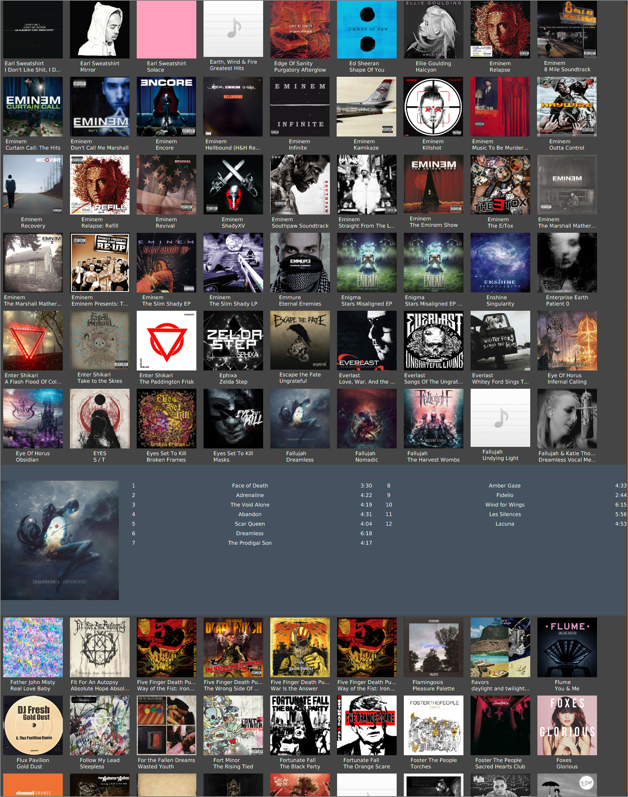

# Cassette Music Player 

Do you ever feel like the slog heap of available music players are all missing a few features that the other one has? Sick of having to pick and choose between features and programs, this is my attempt at combining them all into one. For the betterment of the human race, of course.

### Features

##### Things you might enjoy
```
- Album artwork discovery pane, for choosing music from those pretty pictures.
- List of genres, to browse through based on which type of music you wish to lose yourself to.
- Dark mode built-in, because well, we all know basement dwellers dont like bright lights.
- Attempts to offer the largest amount of functinality without compromising ease of use and aesthetic.
```
##### Supported formats
```
- Plays: AAC, Mp3, Mp4, Wav, Flac
- Tags: Mp3, Mp4 (Mp4 audio, M4a and M4p audio) Ogg Vorbis, Flac, Wav, Aif, Dsf and Wma
- Looking to expand these in future releases.
```
### Screenshots
