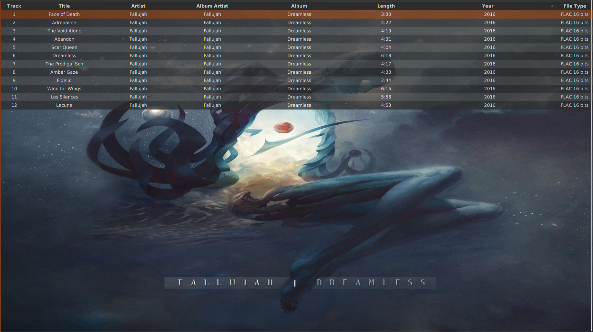

# Cassette Music Player 

Do you ever feel like the slog heap of available music players are all missing a few features that the other one has? Sick of having to pick and choose between features and programs? This is my attempt at combining them all into one. For the betterment of the human race, of course.

## Features

### Things you might enjoy

- Album artwork discovery pane, for choosing music from those pretty pictures.
- An equally loveable playlist pane, for crafting that perfect music listening experience
- List of genres, to browse through based on which type of music you wish to lose yourself to.
- Dark mode built-in, because well, we all know basement dwellers dont like bright lights.
- Attempts to offer the largest amount of functinality without compromising ease of use and aesthetic.

### Supported formats

- Plays: AAC, Mp3, Mp4, Wav, Flac.
- Tags: Mp3, Mp4 (Mp4 audio, M4a and M4p audio) Ogg Vorbis, Flac, Wav, Aif, Dsf and Wma.
- Looking to expand these in future releases.
- Plus a whole lot more thanks to VLC
- Extended list of [VLC supported formats](https://wiki.videolan.org/VLC_Features_Formats/)

## Screenshots



## Getting Started
### Prerequisites

An installation of VLC is required to use this program.

Ensure that the version you have is in accordance with your architecture(64 bit OS = 64 bit VLC).

VLC can be installed [here](https://www.videolan.org/vlc/)

Alternatively, in Ubuntu based systems use the command
```
sudo apt install vlc
```
This is currently required by the JNA library.
I do plan to find an easier method for the user in future builds, though.

### Installing

Given that this is in pre-alpha, i do not have installation instructions yet. 
If this interests you, star this bad boy and come back soon!
In the meantime, i am very much open to suggestions, comments or pull requests.

### Version

The current version is a loose reflection of the state of the program. 
Formal release is scheduled for later this year, and will then be a more
accurate representation of updates.

## Considerations
### Authors

Me, of course! Just me, as of now.

- Justin Lautner <jlautner@protonmail.com>

Have any questions or concerns? Feel free to shoot me an e-mail.

Want to send me a personalized hate message straight to my inbox? I'm all ears!

### License

This project is licensed under Apache-2.0.

### Acknowledgements

A special thanks to the following, for making this possible...

[jaudiotagger](https://github.com/goxr3plus/jaudiotagger)

[vlcj](https://github.com/caprica/vlcj)

Inspired by...

[Clementine Media Player](https://github.com/clementine-player/Clementine)

[MusicBee](https://getmusicbee.com)

God bless these creators.

